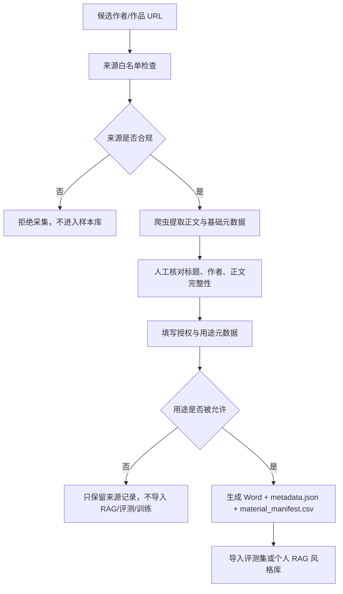

# 样本采集与爬虫工作流

## 结论

MVP 可以使用爬虫辅助整理作者样本，但爬虫必须定位为“授权样本采集器”，不是“任意作者作品抓取器”。

默认规则：

- 可以采集：用户本人上传/授权、组织成员授权、团队内部原创、开放许可、公共领域文本。
- 不可以采集后入库：未授权现代作者全文、付费/会员/App 内作品、绕过登录或反爬取得的内容。
- 不可以对外宣传：基于未授权作者样本“模仿某某作家风格”。
- 每份样本必须有元数据和使用范围，不能只有正文。

## 推荐采集流程



## 来源白名单

第一版只建立白名单，不做开放域批量爬取。

白名单字段：

```csv
source_site,base_url,source_type,allowed_paths,disallowed_paths,robots_policy,terms_url,license_name,license_url,default_allowed_for_eval,default_allowed_for_rag,default_allowed_for_training,owner,reviewed_at,notes
```

示例：

```csv
organization_site,https://example.org/writers,organization_authorized,/works/,/members-only/,follow,https://example.org/terms,,,true,true,false,songw,2026-08-04,仅采集已签授权作者页面
public_domain_archive,https://example.net/public-domain,public_domain,/texts/,/accounts/,follow,https://example.net/terms,Public Domain,https://example.net/license,true,true,false,songw,2026-08-04,仅作系统流程测试
```

## 单篇 Material 必填元数据

采集器导出时必须生成：

- `.docx`：便于人工审阅和整理。
- `.metadata.json`：单篇作品的完整来源、授权、用途和正文 hash。
- `material_manifest.csv`：批量导入评测集/RAG 前的总清单。

必填字段：

| 字段 | 说明 |
|---|---|
| `source_type` | user_upload / organization_authorized / internal_original / open_license / public_domain |
| `source_url` | 原始网页地址 |
| `source_site` | 来源站点 |
| `author_name` | 作者名 |
| `title` | 作品标题 |
| `rights_status` | 权利状态说明，例如“作者授权用于 MVP 评测和个人 RAG” |
| `license_name` | 开放许可名称；非开放许可可空 |
| `license_url` | 开放许可链接；非开放许可可空 |
| `authorization_document_id` | 授权记录编号；组织授权必须填写 |
| `allowed_for_eval` | 是否允许用于评测 |
| `allowed_for_rag` | 是否允许进入个人风格 RAG |
| `allowed_for_training` | 是否允许未来训练/LoRA；MVP 默认 false |
| `collector` | 采集人 |
| `collected_at` | 采集时间 |
| `content_hash` | 正文 hash，用于去重和审计 |

## 入库门槛

素材进入系统前必须通过四个检查：

1. 来源检查：URL 在白名单内，且没有违反 robots、网站条款、付费墙、登录限制。
2. 权利检查：有作者/组织授权、开放许可依据，或确认属于公共领域。
3. 用途检查：`allowed_for_eval`、`allowed_for_rag`、`allowed_for_training` 分开记录，不能混用。
4. 质量检查：正文完整、作者标题正确、没有混入评论区/导航/广告。

未通过检查的材料只能留在“候选素材”区，不得导入：

- MVP 评测集
- 用户个人 RAG
- Prompt 示例库
- 未来微调/LoRA 训练集
- 对外演示环境

## 工具要求

`tools/web_article_collector` 当前作为本地前置工具使用，要求：

- 只支持公开 HTTP/HTTPS HTML 页面。
- 不处理登录、付费墙、验证码、App 抓包、反爬绕过。
- 导出前必须确认授权状态。
- 导出时写入 `.docx`、`.metadata.json` 和 `material_manifest.csv`。
- 未来如做批量采集，必须先读取来源白名单，并设置低频率、失败重试上限和人工复核队列。

## 对 MVP 评测集的影响

MVP 40 条评测任务可以用爬虫辅助准备 Writer 样本，但首轮建议结构如下：

- 5-8 个 Writer。
- 每个 Writer 3-5 篇样本。
- 每篇样本先进入 `candidate_materials`。
- 审核通过后再进入 `approved_materials`。
- 只有 `allowed_for_rag=true` 的材料可进入向量库。
- 只有 `allowed_for_eval=true` 的材料可绑定到评测任务。
- `allowed_for_training=true` 在 MVP 默认不用，后续 Personal LoRA 单独授权。

## 合规依据提示

这不是法律意见，正式公网发布前需要律师确认。

当前方案主要依据：

- 《中华人民共和国著作权法》将文字作品纳入保护范围，并规定复制权、信息网络传播权、改编权、汇编权等权利。
- 《生成式人工智能服务管理暂行办法》要求训练数据处理使用合法来源数据和基础模型，涉及知识产权的不得侵害他人权利。
- 面向公众提供生成式 AI 服务，还需要关注生成内容标识、隐私保护、投诉举报和内容治理要求。
